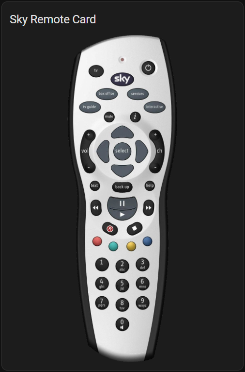

# Sky Remote Card

Card to represent a Sky box remote for use with Sky Remote Control integration



## Installation

Use [HACS](https://hacs.xyz) or place the contents of dist into config/www/hacs-sky-remote-card/

```yaml
resources:
  url: /local/hacs-sky-remote-card/hacs-sky-remote-card.js
  type: module
```

## Sizing

If the GUI layout sizing options are too small, manually increase the number of rows & columns by pressing show code editor and changing the values
